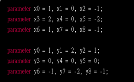
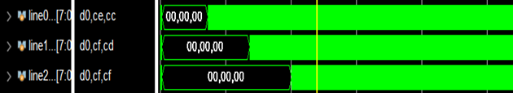

# verilog_Sobel
## 設計原理
左:分別代表為Gx和Gy的各個位元數值

右:count_in為記錄輸入的數字；count_out為記錄現在要輸出哪一位數值

Count_in主要為控制輸入訊號(busy)的計數器，當count_in<= 1023時，busy即一直為0，不斷的輸入pix_data。而當count_in >= 1024時，即將busy設為1，訊號則不會進來。
Count_out為輸出位置的計數器，而當count_in <= 67，輸入的pix_data還不夠多能夠做sobel運算，當count_in >= 67，即能夠開始做輸出，因為當count_out = 33時，count_in = 100，已經能夠對第33個圖像做sobel運算，影響原因為下方要介紹的line_buffer和FIFO

 

 

因為pix_data是一個一個由左而右，由上而下輸入，而每次sobel運算時都需要三行的數據，所以設計了line0, line1, line2，代表每一行，透過FIFO的設計，將數據一個一個推入line。每一行的數據被擠出時，同時作輸出(line0_out = line0[32], line1_out = line1[32] …)，並且將數據放入下一個line(line0[31]line1[0], line1[32]line2[0])，進行line_buffer。由下圖波型可以看到，最後三條line數據會對齊，而line0代表為後進來的行數，line2代表為先進來的行數。對齊後，計算出的sobel值為第33個，但輸出是要完整的尺寸，所以透過上面的count_out和count_in，確保輸出時為正確位置的數值。

  

由於line_buffer和FIFO的關係，每個數據在每一行最後的時候會被輸出。當三行對齊時，即形成三行輸出。而sobel 運算需要3x3的數據，所以透過line0_data, line1_data, line2_data，形成3x3的矩陣。而當每次line_buffer輸出數據時，就將數據在3x3內推移，形成一個小FIFO，讓3x3矩陣能夠逐一對每個數據做sobel運算。(數據對齊後即為第一個要計算的位置, 第33格。由於FIFO原因，要輸入三行數值後，再輸入三個第四行的值，才會得到第33格的3x3矩陣，而這時前面要輸出前32格的數值，所以32x3+3-32=67，所以count_in>=67時，即輸入兩行後再加三個數，就要使count_out記數，開始輸出，)。
因為是line_buffer和FIFO的關係，數據會形成上下顛倒，左右相反的關係，所以在作sobel運算時，須將矩陣各個位元乘與Gx和Gy的上下左右相反的矩陣。因為每一位數字都要輸出，但sobel運算後，會使矩陣縮小，但要按造順序作輸出，所以這時透過count_out去確定此時要輸出的sobel值是原圖的邊界(sobel = 0)，還是計算後的sobel值。邊界的關係總共有四個，分別為第0行(count_out/32 = 0, 0 ~31), 第31行(cout_out/32 = 31, 992~1023),最左邊(count_out%32 = 0, 0, 32,64…),最右邊(count_out%32 = 31, 31, 62, 93…)。同時還要判別sobel運算後，數值的值域(0~255)。

 

最後要輸出答案時，count_in要滿足足夠的pix_data數量，才能將valid設為1，同時輸出sobel值。

